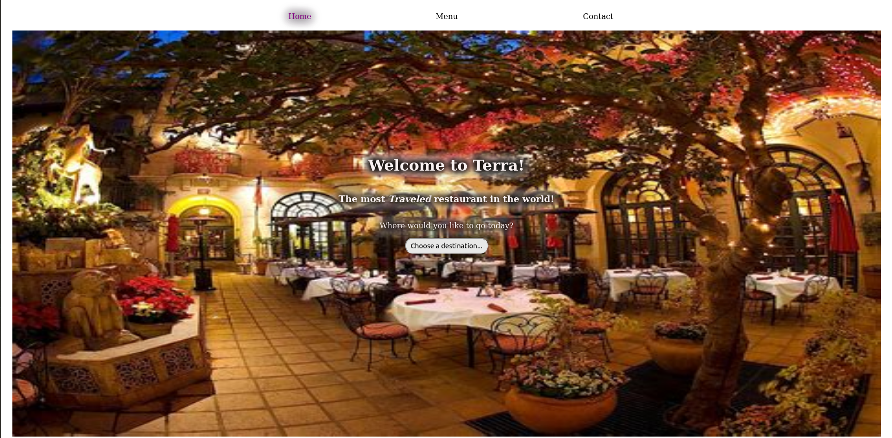

# Restaurant Terra

> This is a basic Restaurant mockup with a home / menu / contact page viewed using tab switching.

### Features

-   Easy navigation with tab switching
-   All HTML elements printed to DOM
-   Active tab styling

###### Coming Features

-   Menu changes based on chosen destination

## Pages

-   Home
-   Menu
-   Contact

## Built With

-   Ubuntu
-   Atom
-   HTML / CSS / JavaScript

## Live Demo

Click the [Live Link](https://eager-liskov-5e3c2d.netlify.app/) to visit this site now!  

## Local Demo

To get a local copy up and running follow these simple steps.

#### Prerequisites

In order to use this project you must have a terminal, web browser, and JavaScript enabled locally.

#### Setup

1.  Clone this repository with `git clone` [`https://github.com/defoebrand/Restaurant.git`](https://github.com/defoebrand/Restaurant.git) using a terminal or clone to a project using your favorite editor.
2.  Navigate to the folder where your project is located.
3.  Open the `/dist/index.html` file in the browser of your choice to view this page.

## Author

👤 **Brandon Defoe**

-   Github: [@defoebrand](https://github.com/defoebrand)
-   LinkedIn: [@defoebrand](https://www.linkedin.com/in/defoebrand/)
-   Gmail: <mailto:defoe.brand@gmail.com>

## Show your support

Give a ⭐️ if you like this project!

## :clap: Acknowledgments

-   Microverse
-   Odin Project
-   The Kermits

## 📝 License

This project is licensed by Microverse and the Odin Project.
